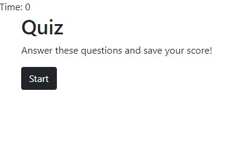

# Code Quiz

## Description

This app is a timed coding quiz. Your score is based on the time remaining when you have finished answering all the questions. Each wrong answer will cost you 5 seconds on your timer. Once you have completed the quiz, you will submit your initials and they will then be displayed through local storage on the highscores page. 

## User Story

```
AS A coding boot camp student
I WANT to take a timed quiz on JavaScript fundamentals that stores high scores
SO THAT I can gauge my progress compared to my peers
```

## Acceptance Criteria

```
GIVEN I am taking a code quiz
WHEN I click the start button
THEN a timer starts and I am presented with a question
WHEN I answer a question
THEN I am presented with another question
WHEN I answer a question incorrectly
THEN time is subtracted from the clock
WHEN all questions are answered or the timer reaches 0
THEN the game is over
WHEN the game is over
THEN I can save my initials and my score
```

## Deployed

https://kge123.github.io/code-quiz/

## Demo

[]
